  

<table width="100%">
  <tr>
    <td>
      <strong>[OPERATOR_INFO]</strong>
<pre>
SYSTEM STATUS: ACTIVE
OPERATOR:      BootlegYouki
ROLES:         Web Developer / App Developer / Designer
</pre>
    </td>
  </tr>
</table>

<table width="100%">
  <tr>
    <td>
      <strong>[SYSTEM_TELEMETRY]</strong>
<pre>
Frontend & Core  ::  React / Svelte / TypeScript / Tailwind CSS / Vite
Cross-Platform   ::  Tauri (Rust) / Electron / Expo (React Native)
Backend Systems  ::  Rust / Node.js
Data & Cloud     ::  PostgreSQL / SQLite / Supabase
</pre>
    </td>
  </tr>
</table>

<table width="100%">
  <tr>
    <td>
      <strong>[ACTIVE_LOGS]</strong>
<pre>
- building high-fidelity desktop dashboards & mobile apps
- crafting retro-brutalist user interfaces & custom design systems
- open for queries on Tauri, Rust systems, and custom web interfaces
</pre>
    </td>
  </tr>
</table>

  

